# ER Diagram — Mermaid Source

**Project:** University Management System (ICT Education)
**Version:** v2.4.1
**Generated from:** `backend/app/models/*.py` (26 SQLAlchemy model files, read in full — not from `docs/Database_Design.md`'s text ERD)

This is the authoritative, machine-checkable ER diagram source. Paste the code block below into the [Mermaid Live Editor](https://mermaid.live) or any Mermaid-compatible renderer (GitHub natively renders ```mermaid``` code fences) to view it visually. The PNG and PDF versions in this same folder are rendered from the identical underlying data model (`er_model.py`), so all four output formats are guaranteed consistent with each other and with the actual codebase.

## Legend

- **PK** — Primary Key
- **FK** — Foreign Key
- **UK** — Unique constraint (a bare `UK` is a standalone unique column; `FK,UK` means the foreign key column itself is unique, i.e. a 1:1 relationship)
- Relationship cardinality notation (crow's foot, standard Mermaid ERD syntax):
  - `||--||` — one-to-one (the child's FK column is itself unique)
  - `||--o{` — one-to-many, FK required (`NOT NULL`)
  - `|o--o{` — one-to-many, FK optional (nullable)
- Each relationship label shows the exact FK column name and its `ON DELETE` behavior, e.g. `exam_id (CASCADE)`.
- Tables are grouped with `%%` comments into the 8 logical domains: Identity, Academic Structure, Examination, Scheduling, Attendance, Results, Fees, Notifications — matching the grouping used in the PNG/PDF/drawio versions.

## Diagram

```mermaid
erDiagram

    %% ============================================================
    %% GROUP: Identity
    %% ============================================================
    USER {
        uuid id PK
        string email UK
        string password_hash
        enum role
        boolean is_active
        string current_refresh_token_jti
        datetime refresh_token_expires_at
        datetime created_at
        datetime updated_at
    }

    ADMIN {
        uuid id PK
        uuid user_id FK,UK
        string first_name
        string last_name
        datetime created_at
        datetime updated_at
    }

    STUDENT {
        uuid id PK
        uuid user_id FK,UK
        uuid department_id FK
        string first_name
        string last_name
        string profile_photo_url
        date date_of_birth
        date enrollment_date
        datetime created_at
        datetime updated_at
    }

    TEACHER {
        uuid id PK
        uuid user_id FK,UK
        uuid department_id FK
        string first_name
        string last_name
        string profile_photo_url
        date hire_date
        datetime created_at
        datetime updated_at
    }

    PARENT {
        uuid id PK
        uuid user_id FK,UK
        string first_name
        string last_name
        string phone_number
        datetime created_at
        datetime updated_at
    }

    PARENT_STUDENT_LINK {
        uuid id PK
        uuid parent_id FK
        uuid student_id FK
        string relationship_type
        datetime created_at
    }

    %% ============================================================
    %% GROUP: Academic Structure
    %% ============================================================
    DEPARTMENT {
        uuid id PK
        string name UK
        string code UK
        datetime created_at
        datetime updated_at
    }

    COURSE {
        uuid id PK
        uuid department_id FK
        string name
        string code UK
        integer credit_hours
        datetime created_at
        datetime updated_at
    }

    ROOM {
        uuid id PK
        string name UK
        string building
        integer capacity
    }

    SEMESTER {
        uuid id PK
        string name UK
        date start_date
        date end_date
    }

    CLASS_SESSION {
        uuid id PK
        uuid course_id FK
        uuid teacher_id FK
        uuid semester_id FK
        string section_label
        datetime created_at
        datetime updated_at
    }

    ENROLLMENT {
        uuid id PK
        uuid student_id FK
        uuid class_session_id FK
        datetime enrolled_at
    }

    %% ============================================================
    %% GROUP: Examination
    %% ============================================================
    EXAM {
        uuid id PK
        uuid class_session_id FK
        uuid created_by_teacher_id FK
        string title
        enum exam_type
        integer time_limit_minutes
        enum status
        datetime scheduled_at
        datetime created_at
        datetime updated_at
    }

    QUESTION {
        uuid id PK
        uuid exam_id FK
        text question_text
        enum question_type
        numeric marks
        text hint
        integer order_index
    }

    QUESTION_OPTION {
        uuid id PK
        uuid question_id FK
        string option_text
        boolean is_correct
    }

    EXAM_SUBMISSION {
        uuid id PK
        uuid exam_id FK
        uuid student_id FK
        datetime submitted_at
        datetime started_at
        enum status
    }

    ANSWER {
        uuid id PK
        uuid submission_id FK
        uuid question_id FK
        text answer_text
        uuid selected_option_id FK
    }

    QUESTION_GRADE {
        uuid id PK
        uuid answer_id FK,UK
        uuid graded_by_teacher_id FK
        numeric awarded_marks
        text feedback
        datetime graded_at
    }

    %% ============================================================
    %% GROUP: Scheduling
    %% ============================================================
    SCHEDULE_ENTRY {
        uuid id PK
        uuid class_session_id FK
        uuid room_id FK
        uuid teacher_id FK
        enum day_of_week
        time start_time
        time end_time
        datetime created_at
        datetime updated_at
    }

    SCHEDULE_CHANGE_REQUEST {
        uuid id PK
        uuid schedule_entry_id FK
        uuid requested_by_teacher_id FK
        uuid confirmed_by_admin_id FK
        jsonb requested_change
        enum status
        datetime created_at
        datetime resolved_at
    }

    %% ============================================================
    %% GROUP: Attendance
    %% ============================================================
    ATTENDANCE_RECORD {
        uuid id PK
        uuid student_id FK
        uuid class_session_id FK
        uuid marked_by_teacher_id FK
        date attendance_date
        enum status
    }

    %% ============================================================
    %% GROUP: Results
    %% ============================================================
    RESULT {
        uuid id PK
        uuid student_id FK
        uuid course_id FK
        uuid semester_id FK
        uuid exam_id FK
        uuid submitted_by_teacher_id FK
        uuid approved_by_admin_id FK
        string grade_letter
        numeric grade_point
        enum status
        datetime submitted_at
        datetime approved_at
    }

    %% ============================================================
    %% GROUP: Fees
    %% ============================================================
    FEE_STRUCTURE {
        uuid id PK
        uuid department_id FK
        uuid semester_id FK
        string name
        numeric amount
        date due_date
        datetime created_at
    }

    INVOICE {
        uuid id PK
        uuid student_id FK
        uuid fee_structure_id FK
        enum status
        datetime issued_at
        string pdf_url
    }

    PAYMENT {
        uuid id PK
        uuid student_id FK
        uuid fee_structure_id FK
        uuid recorded_by_admin_id FK
        numeric amount
        datetime payment_date
        string payment_method
    }

    %% ============================================================
    %% GROUP: Notifications
    %% ============================================================
    NOTIFICATION {
        uuid id PK
        uuid user_id FK
        enum type
        text message
        boolean is_read
        datetime created_at
    }

    %% ============================================================
    %% RELATIONSHIPS  (all FKs verified against backend/app/models/)
    %% ============================================================
    USER ||--|| ADMIN : "user_id (RESTRICT)"
    USER ||--|| STUDENT : "user_id (RESTRICT)"
    USER ||--|| TEACHER : "user_id (RESTRICT)"
    USER ||--|| PARENT : "user_id (RESTRICT)"
    DEPARTMENT ||--o{ STUDENT : "department_id (RESTRICT)"
    DEPARTMENT ||--o{ TEACHER : "department_id (RESTRICT)"
    PARENT ||--o{ PARENT_STUDENT_LINK : "parent_id (RESTRICT)"
    STUDENT ||--o{ PARENT_STUDENT_LINK : "student_id (RESTRICT)"
    DEPARTMENT ||--o{ COURSE : "department_id (RESTRICT)"
    COURSE ||--o{ CLASS_SESSION : "course_id (RESTRICT)"
    TEACHER ||--o{ CLASS_SESSION : "teacher_id (RESTRICT)"
    SEMESTER ||--o{ CLASS_SESSION : "semester_id (RESTRICT)"
    STUDENT ||--o{ ENROLLMENT : "student_id (RESTRICT)"
    CLASS_SESSION ||--o{ ENROLLMENT : "class_session_id (RESTRICT)"
    CLASS_SESSION ||--o{ SCHEDULE_ENTRY : "class_session_id (RESTRICT)"
    ROOM ||--o{ SCHEDULE_ENTRY : "room_id (RESTRICT)"
    TEACHER ||--o{ SCHEDULE_ENTRY : "teacher_id (RESTRICT)"
    SCHEDULE_ENTRY ||--o{ SCHEDULE_CHANGE_REQUEST : "schedule_entry_id (RESTRICT)"
    TEACHER ||--o{ SCHEDULE_CHANGE_REQUEST : "requested_by_teacher_id (RESTRICT)"
    ADMIN |o--o{ SCHEDULE_CHANGE_REQUEST : "confirmed_by_admin_id (RESTRICT)"
    STUDENT ||--o{ ATTENDANCE_RECORD : "student_id (RESTRICT)"
    CLASS_SESSION ||--o{ ATTENDANCE_RECORD : "class_session_id (RESTRICT)"
    TEACHER ||--o{ ATTENDANCE_RECORD : "marked_by_teacher_id (RESTRICT)"
    CLASS_SESSION ||--o{ EXAM : "class_session_id (RESTRICT)"
    TEACHER ||--o{ EXAM : "created_by_teacher_id (RESTRICT)"
    EXAM ||--o{ QUESTION : "exam_id (CASCADE)"
    QUESTION ||--o{ QUESTION_OPTION : "question_id (CASCADE)"
    EXAM ||--o{ EXAM_SUBMISSION : "exam_id (RESTRICT)"
    STUDENT ||--o{ EXAM_SUBMISSION : "student_id (RESTRICT)"
    EXAM_SUBMISSION ||--o{ ANSWER : "submission_id (RESTRICT)"
    QUESTION ||--o{ ANSWER : "question_id (RESTRICT)"
    QUESTION_OPTION |o--o{ ANSWER : "selected_option_id (CASCADE)"
    ANSWER ||--|| QUESTION_GRADE : "answer_id (RESTRICT)"
    TEACHER ||--o{ QUESTION_GRADE : "graded_by_teacher_id (RESTRICT)"
    STUDENT ||--o{ RESULT : "student_id (RESTRICT)"
    COURSE ||--o{ RESULT : "course_id (RESTRICT)"
    SEMESTER ||--o{ RESULT : "semester_id (RESTRICT)"
    EXAM |o--o{ RESULT : "exam_id (RESTRICT)"
    TEACHER ||--o{ RESULT : "submitted_by_teacher_id (RESTRICT)"
    ADMIN |o--o{ RESULT : "approved_by_admin_id (RESTRICT)"
    DEPARTMENT |o--o{ FEE_STRUCTURE : "department_id (RESTRICT)"
    SEMESTER ||--o{ FEE_STRUCTURE : "semester_id (RESTRICT)"
    STUDENT ||--o{ INVOICE : "student_id (RESTRICT)"
    FEE_STRUCTURE ||--o{ INVOICE : "fee_structure_id (RESTRICT)"
    STUDENT ||--o{ PAYMENT : "student_id (RESTRICT)"
    FEE_STRUCTURE ||--o{ PAYMENT : "fee_structure_id (RESTRICT)"
    ADMIN ||--o{ PAYMENT : "recorded_by_admin_id (RESTRICT)"
    USER ||--o{ NOTIFICATION : "user_id (RESTRICT)"
```



## Group → Table Index

| Group | Tables |
|---|---|
| Identity | `user`, `admin`, `student`, `teacher`, `parent`, `parent_student_link` |
| Academic Structure | `department`, `course`, `room`, `semester`, `class_session`, `enrollment` |
| Examination | `exam`, `question`, `question_option`, `exam_submission`, `answer`, `question_grade` |
| Scheduling | `schedule_entry`, `schedule_change_request` |
| Attendance | `attendance_record` |
| Results | `result` |
| Fees | `fee_structure`, `invoice`, `payment` |
| Notifications | `notification` |

## Totals

- **26 tables**
- **48 foreign-key relationships**
- **9 composite unique constraints** forming business keys beyond the surrogate `id` PK (see `docs/Database_Design.md` §9/§10 and the model docstrings in `backend/app/models/` for the full constraint list, including single-column unique constraints not shown here for diagram readability)
